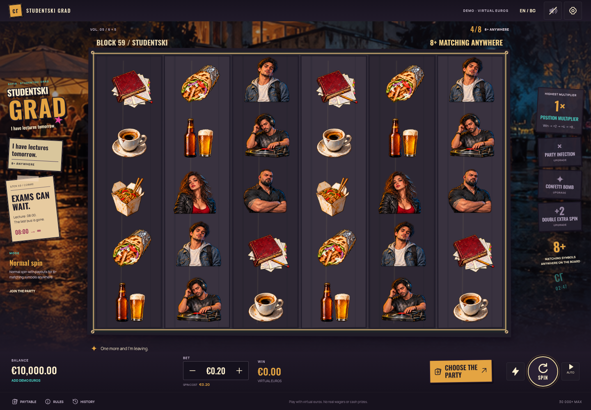

# СТУДЕНТСКИ ГРАД

**„Утре съм на лекции.“** A rebuilt browser slot set in Sofia's student nightlife, with original ink illustrations, Bulgarian/English controls and virtual euro balances.

Presentation 5.2 keeps the version 5 **6 × 5 scatter-pay board**, verified public awards and Studentski Grad party theme. Eight matching physical symbols anywhere win. Normal xWays boosts **its source position only**; upgraded xWays affects **all currently matching regular symbols**. Both use one-way beer throws and splashes. Normal throws are visual cues at matching symbols: no beer or symbol image returns, and those recipients gain no multiplier. All badges on a drop reveal one common symbol in sequence. A new painterly art set replaces the nine paying symbols and four scenes with natural adult portraits, dimensional objects and lived-in Sofia nightlife. The BG/EN remaining-spins counter stays visible through the final bonus spin.




[Art before/after](docs/screenshots/studentski-grad-art-comparison.png) · [Normal one-way throws](docs/screenshots/studentski-grad-normal-copy.png) · [Beer throws](docs/screenshots/studentski-grad-beer.png) · [Bonus counter](docs/screenshots/studentski-grad-bonus-counter.png) · [Phone view](docs/screenshots/studentski-grad-mobile.png) · [8 December feature](docs/screenshots/studentski-grad-december.png) · [Party wheel](docs/screenshots/studentski-grad-wheel.png) · [Extra Spin decision](docs/screenshots/studentski-grad-extra.png)

## Play on Windows, macOS or Linux

Requires npm and Node **20.19+ in the Node 20 series, or 22.12+**. Node 22.16.0 is supported.

Clone this repository, or extract the GitHub ZIP and open a terminal in `Test-main`, the folder containing `package.json`:

```bash
npm ci
npm start
```

Keep that terminal running. `npm start` opens your default browser at the actual local address and chooses an available port. If the browser does not open, copy the **Local** URL printed by Vite. You can also run plain `npm run dev` and open its printed address.

**Use these commands without extra port arguments in PowerShell.** A command printed as `vite --host 0.0.0.0 5174` treats `5174` as a project folder and serves an empty directory, causing 404. Stop it with Ctrl+C and use `npm start` or `npm run dev` without additional arguments.

In Codex cloud, use the existing `/workspace/Test` checkout and `npm run dev -- --port 5173 --strictPort`, then open the environment's forwarded port 5173 preview. Your computer's localhost points to your computer rather than a remote cloud server.

For a production build, run `npm run build`, then `npm run preview` and open its printed Local address. Serve the generated `dist` directory at an HTTP server's root. The GitHub source repository itself is not a hosted game.

## What the rewrite does

- Nine paying symbols: books, coffee, noodles, doner and beer; four illustrated adult student/nightlife characters.
- **8–9 / 10–11 / 12+** matching physical positions pay anywhere, without starting on reel one. A Wild substitutes; extra-shot tokens do not.
- Winning symbols disappear, replacements drop, and the new board is evaluated again. Symbol counts change as the board cascades; there is no fictional ways counter or changing reel height.
- Winning positions become ×2, then double on subsequent winning removals up to ×8192. Participating marked multipliers add; neutral positions do not inflate that sum. Progress belongs to a cell and stays behind when symbols fall.
- All badges on one drop reveal the same chosen regular symbol and individually choose ×2/×4/×8. A normal badge boosts its source position only; upgraded infection boosts every already visible matching regular symbol. Badges resolve in sequence; future unrevealed badges stay untouched until their turn, and later infections can compound earlier revealed sources. In this sampler, a badge has a fixed 0.5% chance of being upgraded outside the infection perk; that perk guarantees every badge draw in the feature is upgraded. Upgraded beer throws replay recorded multiplier targets. Normal beer flies outward to all already visible same-type regulars using the upgraded flight and splash animation. It never returns; these visual recipients gain no multiplier and no additional payable cell is created. Bombs clear regular symbols, protect Wild/Bonus, double affected cells and resolve before replacements fall.
- Dorm, Friday and 8 December bonuses have **7/8/10 starting spins** and **1/2/3 distinct random upgrades**: Infectious xWays, 5×5 Bombs and +2 shots. Bought bonuses first show 3/4/5 invitations landing, then reveal the already committed upgrades on a party wheel. Dorm has one pointer, Friday two pointers to different upgrades, and December a stationary wheel with all three active. Natural four/five-invitation triggers are more accessible through a disclosed fixed lottery when three invitations first land. Wild arrivals vary; buys do not impose a fixed maximum number of Wilds.
- Normal / xBet / Day 2 / Day 64 / Day 1024 cost **1× / 2× / 2.8× / 90× / 3000×** the base bet. Day modes initialize every cell at the advertised multiplier. Direct buys cost **70× / 200× / 600×**; Lucky Draw costs **235×** and selects tiers with **50% / 25% / 25%** probabilities.
- Eligible Extra Spin offers open a **centered decision dialog over a blurred game**. Choose Buy or No thanks before continuing; autoplay stops when an offer appears. The dialog shows the exact euro price, retains the position grid and locked stake, and the purchased spin contains no Bonus symbols. The whole continuation chain shares the **30,000×** cap. The disclosed extra-spin quotation formula is an original implementation; the publisher's private formula is unavailable.
- Integer-cent accounting and atomic saved outcomes prevent repeated charges or payouts on reload. Version 5 uses a new save key and leaves v1, v2 and v3 saves untouched; language and audio preferences are preserved. Invalid data has download, retry and explicit reset controls.

Ordinary landings and refills drop the actual settled symbols smoothly from above, with staggered columns and no cycling reel strip. Block 59 / Блок 59 names the dorm in both interface languages. Space spins while idle and skips presentation while busy. Tapping the reels also skips. Neither action bypasses an Extra Spin decision. The upgrade wheel reveals persisted awards rather than rolling another result, and Continue starts the feature presentation. Normal/turbo, mute/volume, BG/EN, history, paytable and bounded autoplay are available. Refill adds €10,000 virtual euros.

## Research and mathematics

[Duck Hunters research](docs/DUCK-HUNTERS-REDESIGN.md) cites official rules, public demo assets and timestamped official footage. [Research comparison](docs/RESEARCH.md) covers the other Nolimit City titles. [Presentation](docs/PRESENTATION.md) explains how the Studentski Grad artwork and animation sequence follow the findings.

[Mathematics](docs/MATHEMATICS.md) specifies the implemented payout formula, distributions, continuation pricing and accounting. [Simulation results](docs/simulation-results.json) must match the current engine/configuration hashes. The commercial game's private reel strips and theoretical mathematics are unavailable; this demo uses independent distributions and measured results. Do not treat a target or sample mean as a certified return, or as a guarantee that a playing session makes a profit.

The nine-symbol numeric paytable and current feature prices are verified against the official public guest demo. The filtered public initialization data and symbol mapping are recorded in [paytable evidence](docs/duck-hunters-public-paytable.json). Sampler distributions and Extra Spin pricing are also original because the publisher does not disclose its complete random model or continuation quote.

## Validate

Presentation 5.2 passed **62 engine tests and 41 browser checks**, plus production play/reload validation. Details are recorded in the [validation receipt](docs/presentation-validation.json), [Mathematics](docs/MATHEMATICS.md) and [Presentation](docs/PRESENTATION.md). Source hashes identify the exact engine and artwork tested; historical reports are retained under `docs/archive`, including the unchanged version 4 evidence.

Independent version 5 validation completed **13,500,000 paid rounds** at a €0.20 base bet, plus a separate **1,000,000-source-round Extra experiment**. Normal measured **96.86%** in five million rounds (approximate 95% interval **91.68–102.03%**). Other choices have different measured means, detailed in [Mathematics](docs/MATHEMATICS.md#measured-validation). The target is approximately 96%, not certified theoretical RTP. All accounting/cap checks passed.

The version 3 report is retained in [its archive](docs/archive/v3/ARCHIVE.md). Its nine-million-round statistics used the additional normal target and do not describe the current source-only rule.

Engine tests and the production build:

```bash
npm test
npm run build
```

Optional automated browser tests start and close their own server:

```bash
npx playwright install chromium
npm run test:browser
```

On Linux the runner can use `/usr/bin/chromium` when installed. Windows/macOS use Playwright's downloaded Chromium. Set `CHROMIUM_PATH` only to an existing explicit browser executable. `SLOT_BASE_URL` optionally tests an already running development server without closing it.

A reproducible simulation (PowerShell):

```powershell
$env:SIM_ROUNDS = '500000'
$env:SIM_STANDARD_ROUNDS = '5000000'
$env:SIM_EXTRA_ROUNDS = '1000000'
$env:SIM_SEED = '3671928041'
$env:SIM_OUTPUT = 'docs/simulation-results.json'
npm run simulate

# Replace xBet with the larger validation cohort.
$env:SIM_MODE = 'hunt'
$env:SIM_ROUNDS = '5000000'
$env:SIM_EXTRA_ROUNDS = '0'
$env:SIM_MERGE = '1'
npm run simulate
```

For Bash, prefix the same variables on the `npm run simulate` command. `SIM_MODE` selects a specific mode or buy. Simulation outputs include actual-debit return, confidence intervals, win/profit frequencies, payout quantiles, modifier counts, bonuses, cascades and accounting checks.

## Original assets

The [painterly asset record](public/art-v3/README.md) documents the new original image-generation artwork, atlas layout and local asset use. Paying objects and adult portraits use more natural proportions, strong painted shadows and textured materials. Four Studentski Grad scenes depict a Sofia dorm street, pre-party kitchen, Friday nightclub and winter 8 December celebration. Existing authored SVG feature signs retain distinct Bonus/Wild contrast. Commercial game artwork, web photographs and reference-video frames are research references. Audio remains original synthesized sound. Oswald and Manrope include Cyrillic support and their font licenses.

Earlier research, designs and simulations are preserved in `docs/archive/v1`, `docs/archive/v2`, `docs/archive/v3` and `docs/archive/v4` for historical reference. Their measured returns do not describe version 5.
