# Studentski Grad: recorded outcomes and feature variations

These are screenshots of the actual 6×5 game, captured with the ordinary seeded production engine and real interface actions. They show what this implementation can do. The selected seeds are demonstration fixtures, not an estimate of win frequency, bonus frequency, profitability or RTP.

Every example uses a **€0.20 base stake**. Mode and bonus prices are separate from that stake. The [capture receipt](screenshots/gallery/receipt.json) records each seed, choice, debit, settled payout, cap, upgrades, visible animation state, source hashes and PNG hash. Each screenshot replay finishes to exactly the same session, RNG state and accounting as an uninterrupted pure-engine round. No screenshot injects symbols, multiplier targets, payouts, max-win flags or overlays.

## Normal xWays: reveal first, one local boost

The landed speaker first opens to reveal the selected regular symbol while its existing position multiplier stays unchanged. A later local beer/foam impact applies ×2, ×4 or ×8 to that same position. Normal xWays sends no beer or multiplier to other cells.

The following four screenshots use **Normal mode, seed 1**: €0.20 debit and €0.02 total round payout. Reel and row captions count from 1. The two ×2 frames follow the same actual badge in the first refill; the ×4 and ×8 frames show other badges in the initial drop. Badges on one drop share the recorded revealed type.

| Reveal before application | Local ×2 application |
| --- | --- |
| 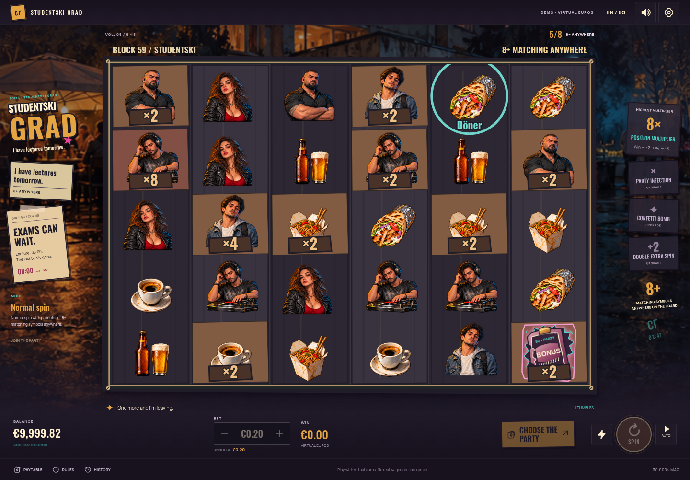 | 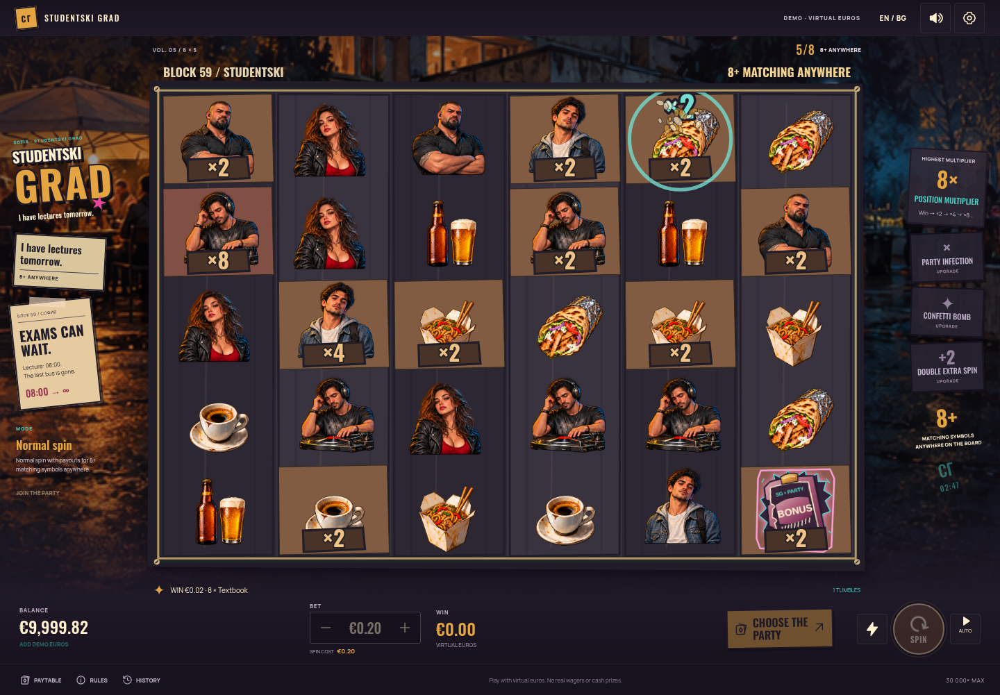 |

| Local ×4 variation | Local ×8 variation |
| --- | --- |
| 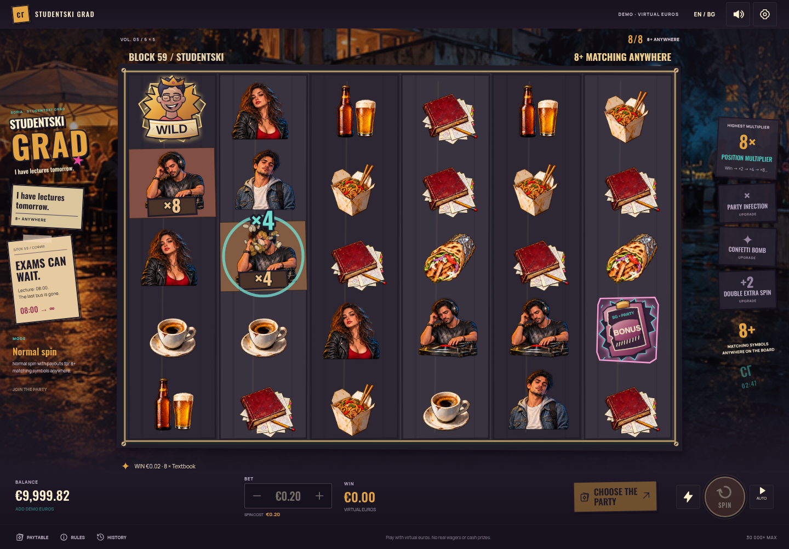 | 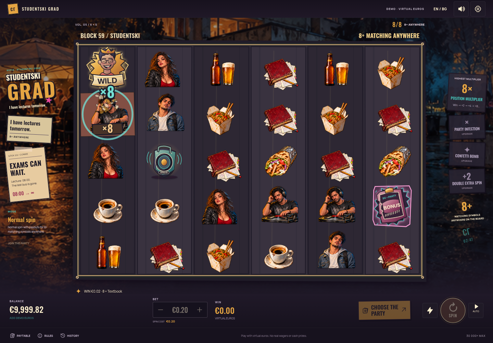 |

## Upgraded xWays: reveal before beer transmission

**Normal mode, seed 55** contains a naturally upgraded speaker without a bonus upgrade. Its source at reel 4, row 1 first reveals Book. Beer then travels to its seven engine-recorded matching Book positions; each position grows when its own beer arrives. The spread frame shows the real staggered sequence in progress. The base round costs €0.20 and pays €5.12.

| Revealed type, existing multipliers retained | Recorded beer transmission and impacts |
| --- | --- |
| 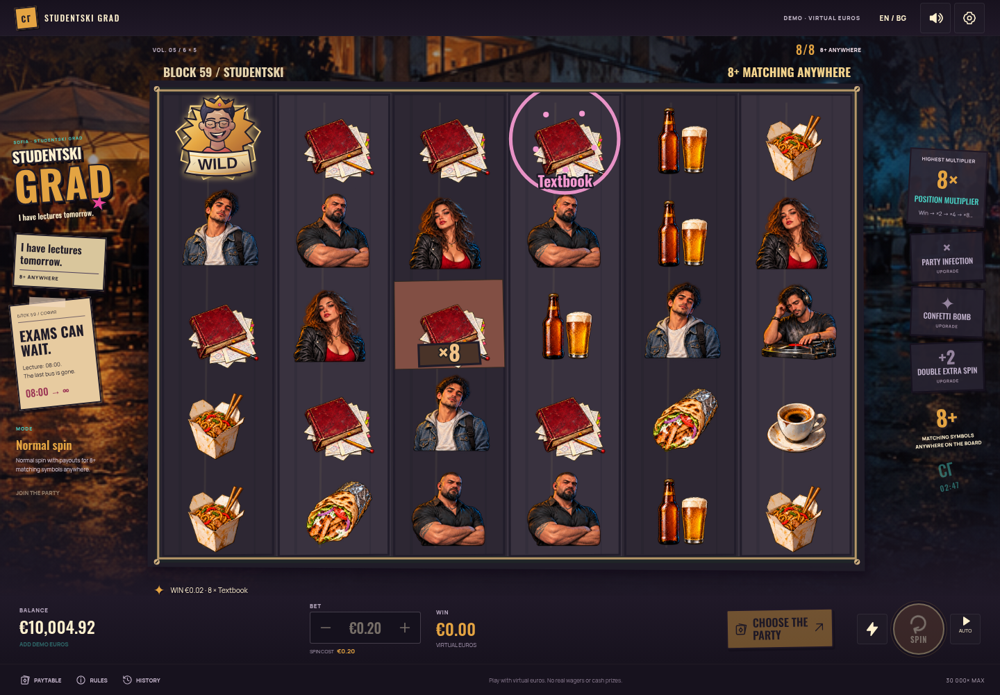 | 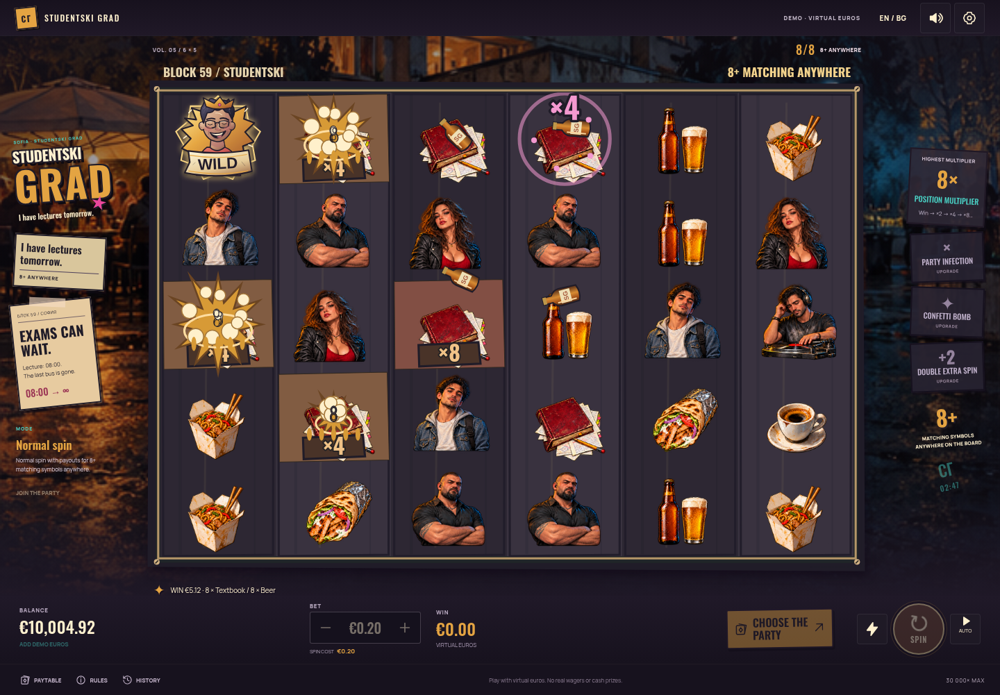 |

The infection bonus perk guarantees upgraded arriving badges. Without that perk, an upgraded variant remains a rare natural badge outcome. The multiplier and target rules are the same in either case.

## Three bonus entrances and wheel variations

Each example below uses **seed 1** and a real bonus purchase. Bought invitations land before the wheel. The wheel displays upgrades already selected and saved by the engine; the screenshots show its actual stopped result.

| Tier | Purchase debit | Free spins at entry | Wheel result | Complete round payout |
| --- | ---: | ---: | --- | ---: |
| Dorm | €14.00 | 7 | One pointer: infection | €65.20 |
| Friday | €40.00 | 8 | Two pointers: infection and bombs | €0.02 |
| December | €120.00 | 10 | All three: infection, bombs and extra spins; stationary wheel | €0.00 |

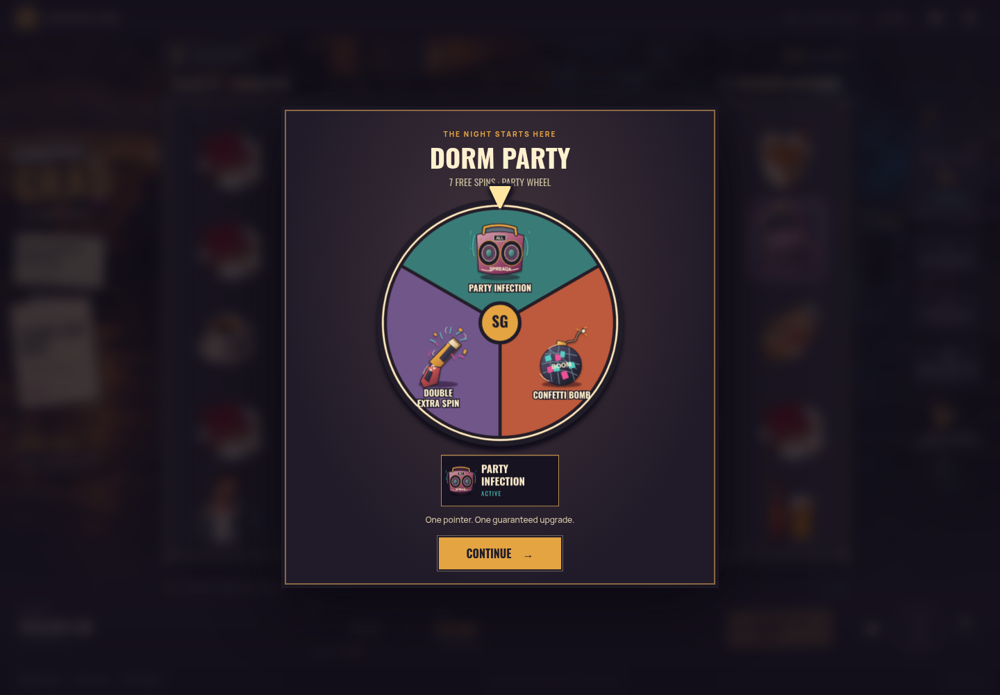

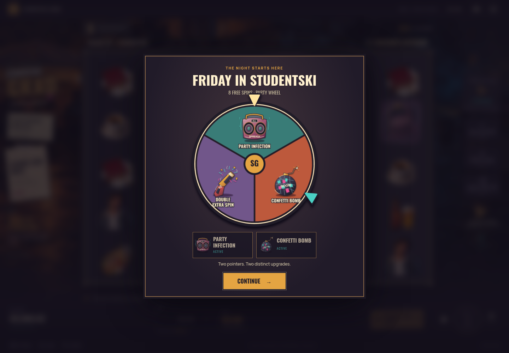

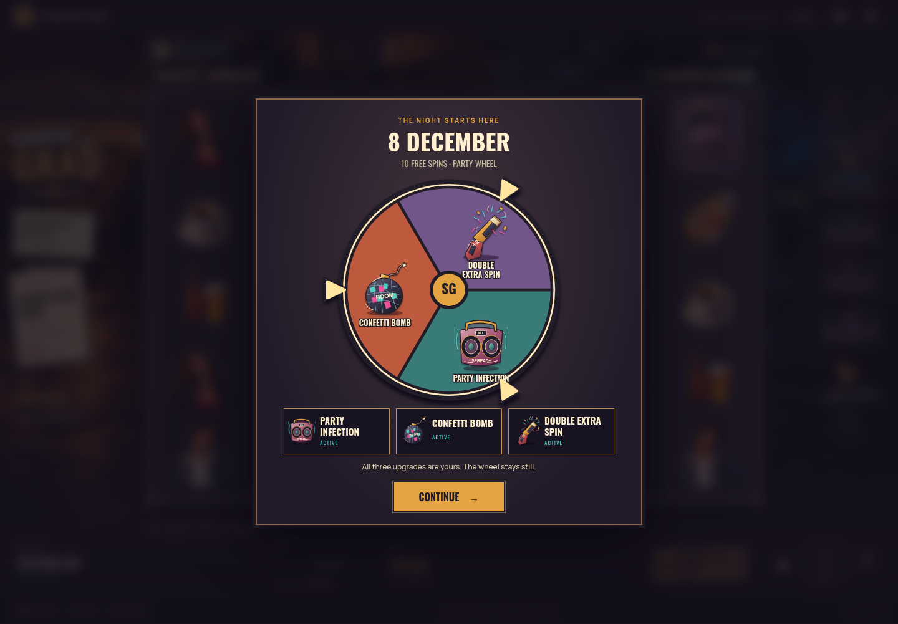

Guarantees concern the entry perks and starting spins. They do not guarantee a payout; the Friday and December examples above illustrate that distinction.

## Position growth, large awards and an optional extra spin

**December purchase, seed 3:** €120.00 debit, ten completed spins and €20.56 total payout. The fourth free spin has a real winning count of matching symbols with persistent positions reaching ×256. Paid symbols clear, their positions double, and the next recorded symbols fall into those positions. Intermediate spin delays are skipped only to reach this documented frame; the engine processes every spin normally.

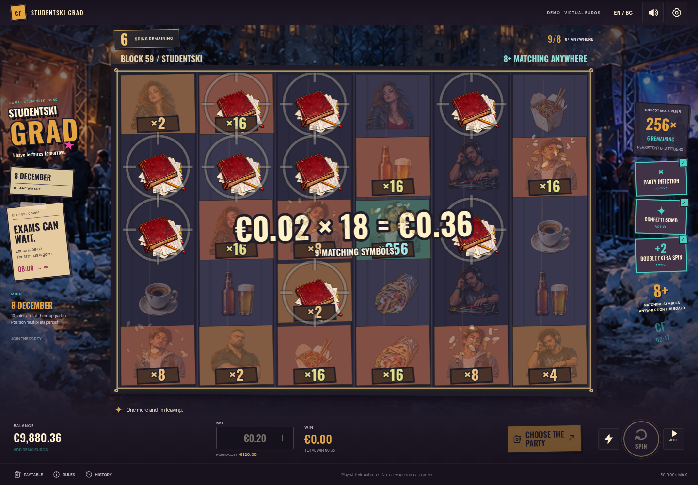

**Day 64, seed 27:** €0.20 base stake, **€18.00 mode debit**, €138.24 payout (691.2× the base stake), two cascade steps and positions reaching ×512. This is an actual paid mode outcome, with its settled euro amount displayed by the game's large-win screen.

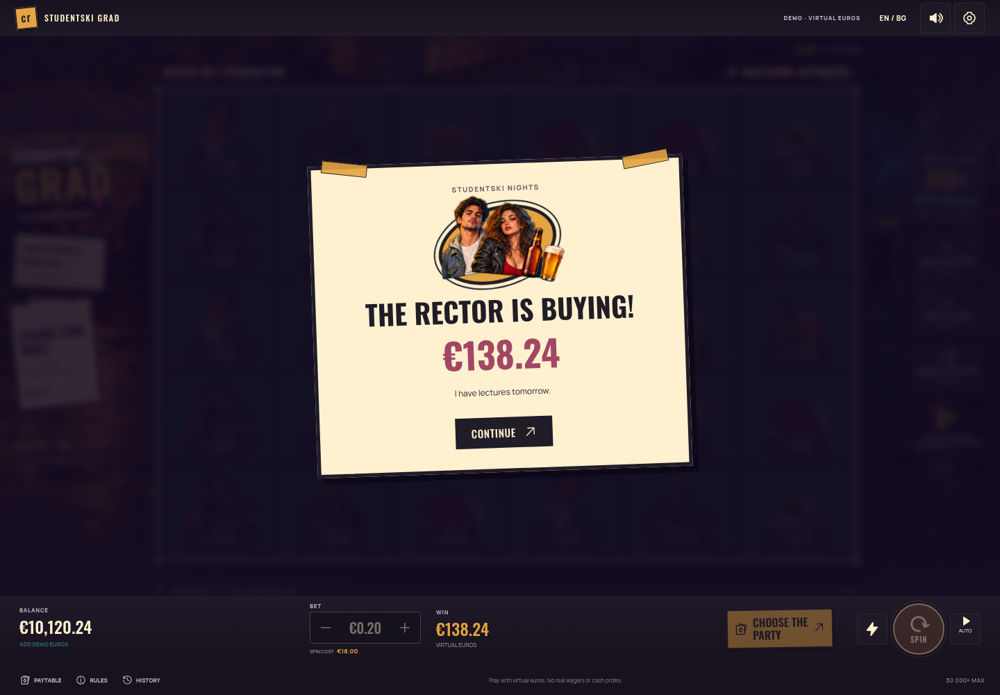

**Normal mode, seed 55:** after the €0.20 round pays €5.12, the game offers a separately priced **€3.09 Extra Spin** using its retained position multipliers. The real modal blurs and disables the board while awaiting a choice. This screenshot shows the offer only; the extra spin has not been purchased or debited. Skipping visual delays does not accept it.

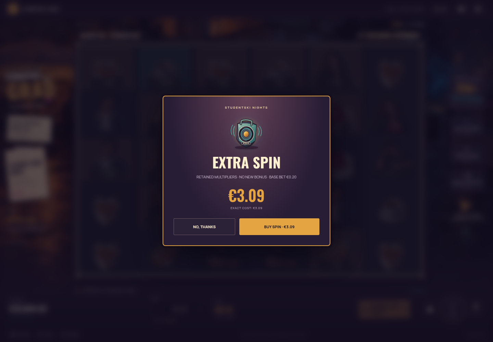

## Actual max-win screen in Bulgarian and English

Both language screenshots replay **Day 1024, seed 3**: **€0.20 base stake**, **€600.00 mode debit** (3,000× base stake), and **€6,000.00 settled payout**, exactly the implementation's **30,000× base-stake cap**. The game terminates this capped round and displays its normal max-win presentation. The headline, amount and cap flag come from that actual engine result.

| Bulgarian | English |
| --- | --- |
|  | 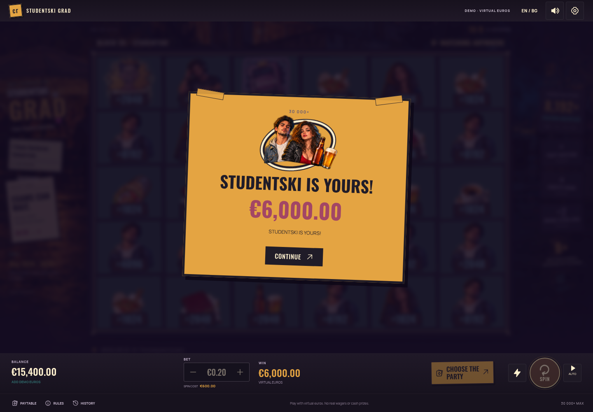 |

These are the same deterministic outcome in two language settings, not two independent wins. A high-priced Day 1024 demonstration establishes that the cap and max-win screen work; it does not establish the probability of reaching the cap in Normal mode or any bonus.

## Reproduce the screenshots

From the repository root:

```sh
npm ci
npx playwright install chromium
npm run capture:gallery
```

The capture script owns an available-port Vite server and closes it when finished. Windows and macOS use Playwright's installed Chromium; Linux can use `/usr/bin/chromium`, and `CHROMIUM_PATH` can select an installed browser. `SLOT_BASE_URL` optionally points to an existing **development** server, since the capture uses existing development reset/read-only snapshot helpers. Production builds omit those helpers.

The script holds actual animation frames briefly so short reveal and impact stages can be photographed reproducibly. It changes no game results or page content. Full-size PNGs and `receipt.json` are written to [screenshots/gallery](screenshots/gallery). The painted raster assets are original project image-generation output, documented in the [painted asset record](../public/art-v3/README.md); the retained original feature vectors are documented in the [SVG asset record](../public/art-v2/README.md). No commercial game sprites or downloaded background photographs are included in these screenshots.
